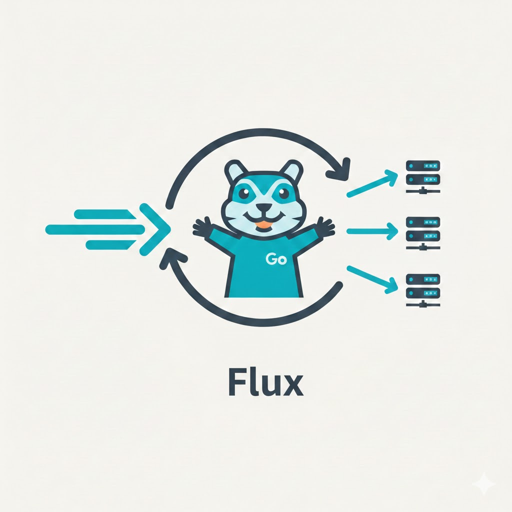

# Flux - Go API Gateway & Load Balancer




A production-ready HTTP **API Gateway** and **Load Balancer** written in pure Go.
Zero external runtime dependencies. Single static binary. Hot-reloadable config.

---

## Features

| Feature | |
|---|---|
| HTTP/1.1 reverse proxy | ✓ |
| Round Robin | ✓ |
| Weighted Round Robin (smooth, nginx algorithm) | ✓ |
| Least Connections | ✓ |
| Active health checks (periodic probing) | ✓ |
| Passive health checks (mark unhealthy on dial error) | ✓ |
| Zero-downtime hot-reload (YAML file watcher) | ✓ |
| Per-IP rate limiting (token bucket) | ✓ |
| JWT authentication (HS256) with exclude list | ✓ |
| Structured JSON logs to stdout | ✓ |
| `X-Forwarded-For`, `X-Real-IP`, `X-Request-Id` headers | ✓ |
| Admin REST API (runtime backend management) | ✓ |
| Graceful shutdown (SIGTERM/SIGINT drain) | ✓ |
| Docker image (distroless, non-root, HEALTHCHECK) | ✓ |
| Version info embedded at build time | ✓ |

---

## Architecture

```
                    ┌──────────────────────────────────────────────┐
                    │                  Flux binary                 │
                    │                                              │
Client ── HTTP ────►│  /healthz ── local JSON response            │
                    │                                              │
                    │  /* ──► Logger                               │
                    │           └─► RateLimiter  (per-IP bucket)  │
                    │                 └─► JWTAuth (HS256)          │
                    │                       └─► Reverse Proxy      │
                    │                             │                │
                    │              ┌──────────────┼─────────┐      │
                    │              ▼              ▼         ▼      │
                    │          Backend A      Backend B   ...      │
                    └──────────────────────────────────────────────┘
                                  ▲              ▲
                    Health Monitor│ (background) │
                    ──────────────┴──────────────┘

Admin REST API (:9091) ──► Registry ──► live picker swap
```

---

## Quick Start

**Prerequisites:** Go 1.24+ or Docker.

### Binary

```bash
# 1. Build
make build

# 2. Start a backend (any HTTP server)
python3 -m http.server 8081

# 3. Run Flux
./bin/gateway -config configs/gateway.yaml

# 4. Send a request
curl http://localhost:8080/

# 5. Check gateway health
curl -s http://localhost:8080/healthz | jq .
# {
#   "status": "ok",
#   "version": "dev",
#   "commit": "abc1234",
#   "build_date": "2024-01-01T00:00:00Z",
#   "uptime": "12s"
# }
```

### Docker Compose

```bash
# Start Flux + two echo backends
make docker-run

curl http://localhost:8080/   # → hello from backend-1
curl http://localhost:8080/   # → hello from backend-2

# Stop
make docker-stop
```

### Docker (standalone)

```bash
make docker-build

docker run -d \
  -p 8080:8080 \
  -p 9091:9091 \
  -v $(pwd)/configs/gateway.yaml:/etc/flux/gateway.yaml:ro \
  flux:latest -config /etc/flux/gateway.yaml
```

The image is based on `gcr.io/distroless/static-debian12:nonroot`:
- Non-root user (uid 65532)
- No shell — minimal attack surface
- CA certificates included — TLS to backends works out of the box
- Built-in `HEALTHCHECK` directive

---

## Configuration

All settings live in a single YAML file. Pass it with `-config`:

```bash
./bin/gateway -config /path/to/gateway.yaml
```

**Hot-reload:** edit and save the file while Flux is running — changes take effect within one second, without restarting.

### Full reference

```yaml
# Address the gateway listens on.
# Default: ":8080"
listen_addr: ":8080"

# Load-balancing strategy.
# Options: round_robin | weighted_round_robin | least_connections
# Default: round_robin
strategy: "round_robin"

# Upstream backends. At least one required.
backends:
  - url: "http://app-1:8080"
    weight: 2          # relative weight (used by weighted_round_robin; ignored by others)
  - url: "http://app-2:8080"
    weight: 1

# Active health checking — Flux periodically probes each backend.
health_check:
  enabled:  true
  interval: "10s"    # how often to probe
  timeout:  "2s"     # per-probe deadline
  path:     "/healthz"  # HTTP path to GET

# Per-IP token-bucket rate limiting.
rate_limit:
  enabled: false
  rps:     100       # sustained requests per second per client IP
  burst:   200       # maximum instantaneous burst

# JWT Bearer-token authentication (HS256).
auth:
  enabled: false
  secret:  "your-256-bit-secret"
  exclude:             # paths that bypass auth entirely
    - "/healthz"
    - "/metrics"

# Admin REST API server.
# Default: enabled on :9091
admin:
  enabled:     true
  listen_addr: ":9091"
```

### Strategy guide

| Strategy | Best for |
|---|---|
| `round_robin` | Stateless services with homogeneous backends |
| `weighted_round_robin` | Mixed-capacity backends — higher `weight` receives proportionally more traffic |
| `least_connections` | Long-lived or variable-cost requests (streaming, uploads) |

### Example configs

| File | Description |
|---|---|
| [`configs/examples/minimal.yaml`](configs/examples/minimal.yaml) | Single backend, no auth, no rate limiting |
| [`configs/examples/production.yaml`](configs/examples/production.yaml) | 3 backends, all features on, least-connections |
| [`configs/examples/jwt-auth.yaml`](configs/examples/jwt-auth.yaml) | JWT auth with excluded public paths |
| [`configs/examples/rate-limited.yaml`](configs/examples/rate-limited.yaml) | Token-bucket rate limiting with tuning notes |

---

## Deployment

### Binary (bare-metal / VM)

```bash
make build
./bin/gateway -config /etc/flux/gateway.yaml
```

For production, run under a process supervisor (systemd, runit, etc.):

```ini
# /etc/systemd/system/flux.service
[Unit]
Description=Flux API Gateway
After=network.target

[Service]
ExecStart=/usr/local/bin/gateway -config /etc/flux/gateway.yaml
Restart=on-failure
User=nobody

[Install]
WantedBy=multi-user.target
```

### Docker

```bash
# Build with version info
docker build \
  --build-arg VERSION=$(git describe --tags --always) \
  --build-arg COMMIT=$(git rev-parse --short HEAD) \
  --build-arg BUILD_DATE=$(date -u +%Y-%m-%dT%H:%M:%SZ) \
  -f deployments/Dockerfile \
  -t flux:latest .

# Run
docker run -d \
  --name flux \
  -p 8080:8080 \
  -p 9091:9091 \
  -v /host/path/gateway.yaml:/etc/golb/gateway.yaml:ro \
  flux:latest
```

### Docker Compose (with backends)

```bash
make docker-run    # starts flux + 2 echo backends
make docker-stop   # tears everything down
```

The Compose file at [`deployments/docker-compose.yml`](deployments/docker-compose.yml) starts Flux only after backends pass their own health checks (`depends_on: condition: service_healthy`).

### Environment variables in config

Secrets should never be hardcoded. Viper expands `${VAR}` syntax in YAML values:

```yaml
auth:
  enabled: true
  secret: "${JWT_SECRET}"
```

Pass at runtime:

```bash
JWT_SECRET=my-secret ./bin/gateway -config gateway.yaml
# or
docker run -e JWT_SECRET=my-secret flux:latest
```

---

## Health Check Endpoint

`GET /healthz` is answered directly by Flux (bypasses all middleware and backends):

```bash
curl -s http://localhost:8080/healthz
```
```json
{
  "status": "ok",
  "version": "v1.0.0",
  "commit": "abc1234",
  "build_date": "2024-01-01T00:00:00Z",
  "uptime": "3m22s"
}
```

Docker and Kubernetes liveness probes can point directly at this endpoint.

---

## Testing

```bash
# Full suite: vet + unit + e2e
make test

# Unit and functional tests only (fast, no subprocess)
make unit-test

# End-to-end tests (compiles the binary, starts real processes)
make e2e-test
```

| Package | Tests | Type |
|---|---|---|
| `internal/config` | 7 | Unit |
| `internal/strategy` | 12 | Unit |
| `internal/middleware` | 9 | Functional (httptest) |
| `internal/proxy` | 6 | Integration (httptest) |
| `tests/e2e` | 8 | End-to-end (real binary) |

E2E coverage: basic proxy, round-robin distribution, passive failover, rate limiting, JWT auth, excluded paths, YAML hot-reload.

---

## Project Structure

```
flux/
├── cmd/
│   ├── gateway/            Main entry point
│   └── healthcheck/        Docker HEALTHCHECK probe
├── internal/
│   ├── config/             Viper YAML loader + hot-reload watcher
│   ├── strategy/           Load-balancing algorithms + Backend model
│   ├── health/             Active health monitor (background goroutine)
│   ├── middleware/         Logger, RateLimiter, JWTAuth
│   ├── proxy/              Reverse proxy core
│   └── admin/              Admin REST API server + backend registry
├── tests/e2e/              End-to-end test suite
├── configs/
│   ├── gateway.yaml        Default configuration
│   └── examples/           Ready-to-use example configs
├── deployments/
│   ├── Dockerfile          Multi-stage, distroless image
│   └── docker-compose.yml  Local dev environment
├── docs/                   Technical documentation
└── Makefile                Developer workflow
```

---

## Make Targets

```
make build        Compile gateway binary into bin/
make test         vet + unit-test + e2e-test
make unit-test    Unit and functional tests with race detector
make e2e-test     End-to-end tests against compiled binary
make vet          Run go vet on all packages
make tidy         Run go mod tidy
make docker-build Build Docker image with version labels
make docker-run   Start gateway + backends via Docker Compose
make docker-stop  Stop Docker Compose stack
make clean        Remove build artifacts
```

---

## License

MIT — see [LICENSE](LICENSE) for details.
